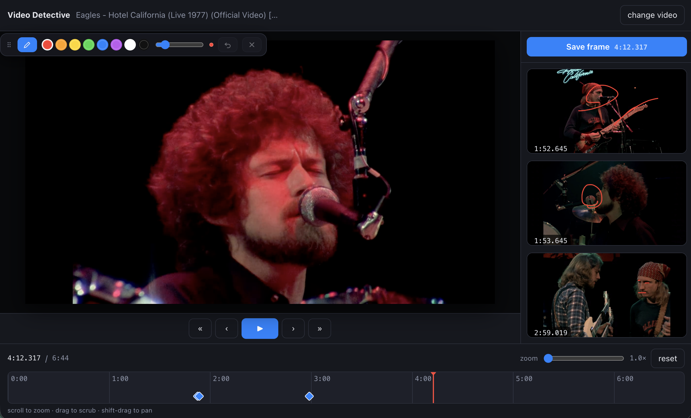

# Video Detective

Scrub a video frame by frame, draw on frames, keep a timestamped log of what you found.



```bash
npm install
npm run dev
```

## What's here

- **Import** — a local video file, a direct video URL (`.mp4`/`.webm`), or a YouTube link.
- **Playback** — transport bar centred under the video: ±1s, ±1 frame, play/pause. Space
  toggles play, `←`/`→` step 1s, `shift` + arrows step a single frame. Clicking the video
  toggles play too.
- **Drawing** — freehand brush over the frame. The floating palette (drag it by the `⠿` grip)
  holds 8 colours, a size slider, undo and clear. `B` toggles drawing mode; `⌘Z` undoes.
  Starting a stroke pauses playback. Strokes are stored in normalised coordinates, so they
  survive resizing and re-render cleanly at source resolution on export.
- **Save frame** — top of the right sidebar. Captures the current frame with the drawing baked
  in, timestamps it, and clears the canvas for the next one. Every saved frame gets a
  thumbnail. Saved frames list in time order; click a thumbnail to jump back and restore its
  drawing. Each has a note field and an image export.
- **Annotations are per-frame** — a drawing belongs to the frame it was made on. Playing,
  seeking, scrubbing or stepping discards it, so the next frame always starts clean. Save it
  first if you want to keep it.
- **Timeline** — the bottom bar zooms: scroll to zoom around the cursor (up to 400×), drag to
  scrub, shift-drag to pan. Tick labels gain milliseconds when zoomed in far enough. Saved
  frames show as diamonds you can click to jump to.

## How YouTube works here

An embedded YouTube iframe is a dead end for this app: it's cross-origin, so its pixels can
never be read into a canvas (no frame capture) and its own play/pause overlay can't be
styled away. So we don't embed it.

Instead, a YouTube link is handed to **yt-dlp** (shipped inside `node_modules` by
`youtube-dl-exec` — nothing to install globally) in a small dev-server middleware,
[server/youtube-source.ts](server/youtube-source.ts):

1. `GET /api/resolve?url=…` dumps the video's formats and picks the best mp4 renditions —
   the highest video-only track up to 1080p, and the best progressive track that still has
   audio.
2. `GET /api/stream?u=…` pipes those bytes through this app's own origin, forwarding `Range`
   so seeking and scrubbing work normally.

The result is a plain `<video>` element: no YouTube UI at all, and `drawImage` on the frame
works, so saved frames contain the real picture. When two renditions exist a quality picker
appears in the top bar (picture quality is preferred over audio by default, since that's what
frame inspection needs); switching keeps your place in the video.

If the resolve fails — no network, yt-dlp blocked, an unusual video — the picker offers the
embedded YouTube player as a fallback. That still plays and annotates, and saved frames get a
*drawing only* thumbnail: the strokes on a grid card, with the timestamp.

## Layout

| File | Role |
| --- | --- |
| [src/App.tsx](src/App.tsx) | state, playback control, frame capture, keyboard |
| [src/components/VideoStage.tsx](src/components/VideoStage.tsx) | `<video>` or YouTube player + overlay |
| [src/components/DrawLayer.tsx](src/components/DrawLayer.tsx) | canvas drawing surface |
| [src/components/Palette.tsx](src/components/Palette.tsx) | draggable brush palette |
| [src/components/Timeline.tsx](src/components/Timeline.tsx) | zoomable scrub bar |
| [src/components/Sidebar.tsx](src/components/Sidebar.tsx) | saved-frame column |
| [src/render.ts](src/render.ts) | stroke painting, shared by the overlay and the export |
| [server/youtube-source.ts](server/youtube-source.ts) | yt-dlp resolve + byte proxy (dev-server middleware) |
